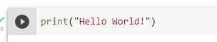

# First steps #
We're gonna start where every programmer begins their journey, a classic `"Hello World"` program.

Open up your favourite text editor or IDE (Integrated Development Environment)and create a file called `hello_world.py`. In this file write the following code 
```py
print("Hello World!")
```

Use the appropriate means from your editor to run this code, or if you're doing it from the terminal

If you're running your code in Google Colab, paste the code in a cell and hit run



If you've done everything correctly you should see the words "Hello World!" written on your screen, If not, follow the steps again and retry.

## Code Breakdown ##
We're now gonna take a look at exactly what we're doing. I'm aware its only one line of code, but it's handy to know what it does.

We first start by writing `print` which is a python built-in function to write things. next we open and close parentheses `()`, this signifies that we call the function, which is a fancy way to say we wish to use it at execution. Inside these parentheses we write what is known as a string, which is any alpha-numeric piece of text enclosed with quotation marks `"`, in our code, `"Hello World!"` is a string which we want to print out, as such we pass it within the parentheses of `print` and voila! we have written our very first python program. 

# Comments #
Comments are a handy way to let people know what a piece of code does, or to keep a mental note for yourself.

Comments in python begin with a hash symbol `#`. Continuing on in `hello_world.py` lets put a comment to let people know what we're doing.

```py
# This prints hello world
print("Hello World!")
```

Comments can also be placed inline with code

```py
print("Hello World!") # This prints hello world
```

Comments are ignored by python code, so they are also an easy way to stop certain pieces of code from executing

```py
# print("This does not print")
print("Hello World!")
```

Executing this code 